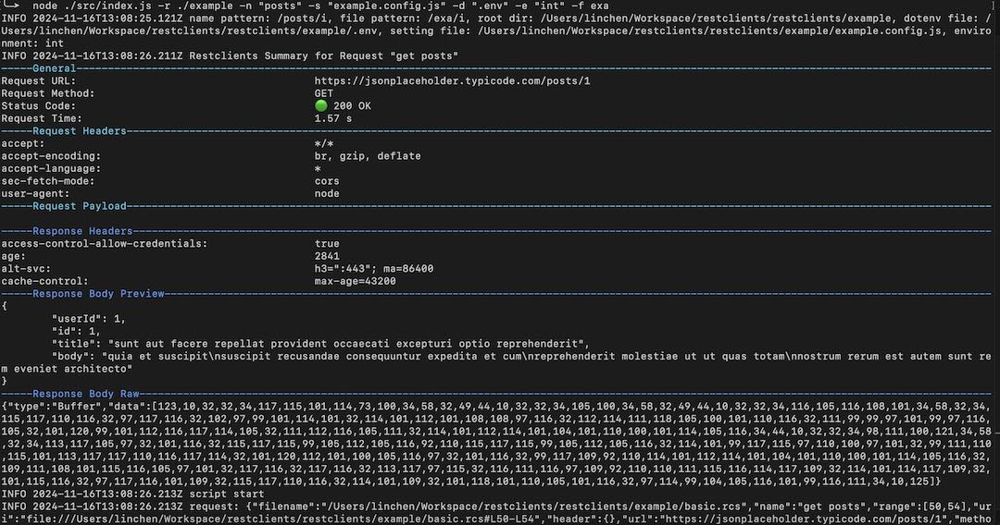

<div align="center">
   <div>
        <a href="" target="_blank" rel="noopener">
            
        </a>
    </div>
</div>

<br />

Rest clients provide a secured and easy to use tools to send requests. This tool is intended to make HTTP requests sent via command line tools like the `curl`, and goodbye to `Postman`.\
This project is inspired by [REST Client](https://github.com/Huachao/vscode-restclient).


### Features

Rest clients includes multiple features to make sending request easier.

* Send `HTTP request` in `.rcs`, `.rest` or `.http` file
* Auto show request context like Network in Chrome dev tool
* Compose _MULTIPLE_ requests in a single file (separated by `###` delimiter)
* Show raw response body
* Authentication support for:
    - Basic Auth
* Environments and static/dynamic variables support
    - Use variables in any place of request(_URL_, _Headers_, _Body_)
    - Support __environment__, __file__ static variables
    - Interactively assign file __prompt__ variables per request
    - Buildin dynamic variables
      + `{{$guid}}`
      + `{{$randomInt min max}}`
      + `{{$timestamp [offset option]}}`
      + `{{$datetime rfc1123|iso8601 [offset option]}}`
      + `{{$localDatetime rfc1123|iso8601 [offset option]}}`
      + `{{$processEnv [%]envVarName}}`
      + `{{$dotenv [%]variableName}}`
    - Easily create/update/delete environments and environment variables in setting file
    - File variables can reference environment, dynamic variables
    - Support for multiple environments
    - Support shared environment to provide variables that available in all environments
    - Support run javascript code per request
* `HTTP` language support
    - `.rcs`, `.http` and `.rest` file extensions support
    - Comments (line starts with `#` or `//`) support
    - Support `json` and `xml` response body preview

## 🚀 Quick Starts

To quick starts, run the following command:

```bash
git clone https://github.com/restclients/restclients.git
cd ./example
npx restclients -r ./example -n "posts" -s "example.config.js" -d ".env" -e "int" -f example
```

### Options
- --rootDir, -r\
    Specify the root directory to search rest clients file
- --namePattern, -n\
    Specify the rest request name match pattern\
- --filePattern, -f\
    Specify the rest clients file name match pattern
- --verbose, -v\
    Show verbose log
- --dotenvFile, -d\
    Specify the dot env file path
- --settingFile, -s\
    Specify the environment setting file path
- --environment, -e\
    Specify the target environment

## Contributing

### ToDo
